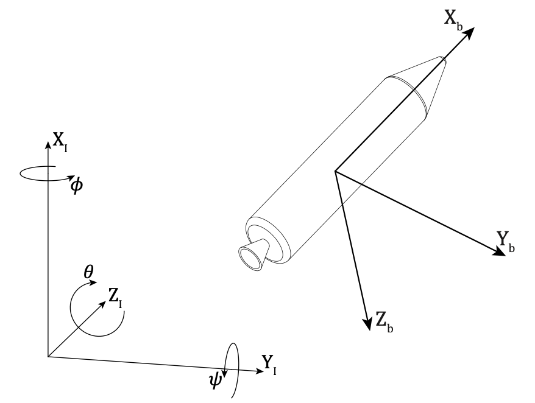
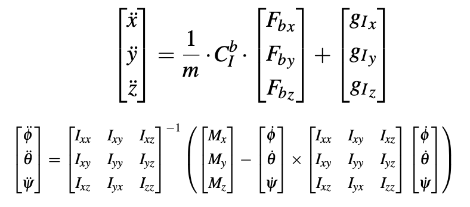

# **Model Predictive Control for Powered Descent Guidance and Control**
In this project, we explore the real-time implementation of Model Predictive Control (MPC) for spacecraft guidance, with a focus on thrust vector control during ascent and descent. 
### *The model*
The vehicle in the study is modeled as a rigid body with six degrees of freedom (6-DoF). Forces and torques from aerodynamics, gravity, and the propulsion system act on the spacecraft's center of gravity (CoG), influencing its motion. 

The study introduces inertial and body reference frames (depicted in Figure 1), where the former is fixed in space, and the latter is moving, linked to the rocket

It is possible to define
the equations of motion (EoM) for the translational and
rotational dynamics by means of Newton’s second law:

where
$$
\begin{align*}
\begin{bmatrix}
\ddot{x} \\
\ddot{y} \\
\ddot{z}
\end{bmatrix}^\top & \text{ are the body’s linear accelerations along } X_I\ Y_I\ Z_I \text{( inertial frame).} \\
\end{align*}
\\
\begin{align*}
\begin{bmatrix}
\mathbf{F}_{bx} \\
\mathbf{F}_{by} \\
\mathbf{F}_{bz}
\end{bmatrix}^\top & \text{ are the forces applied to the body.           }
\end{align*}
\\
\begin{align*}
\begin{bmatrix}
\mathbf{g}_{x}\\
\mathbf{g}_{y} \\
\mathbf{g}_{z}
\end{bmatrix}^\top & \text{ is the gravity force.           }
\end{align*}
\\
\begin{align*}
\begin{bmatrix}
\ddot{\phi} \\
\ddot{\theta} \\
\ddot{\psi}
\end{bmatrix}^\top & \text{ are the angular accelerations.            }  \\
\end{align*}
\\
\begin{align*}
\begin{bmatrix}
\mathbf{M}_{x}\\
\mathbf{M}_{y} \\
\mathbf{M}_{z}
\end{bmatrix}^\top & \text{ are the moments about the Center of Gravity.           }
\end{align*}
\\
\begin{align*}
\begin{bmatrix}
\mathbf{I}_{xx}\\
\mathbf{I}_{yy} \\
\mathbf{I}_{zz}
\end{bmatrix}^\top & \text{ are the inertia tensor components.           }
\end{align*}
$$

### Simplifications
We assume the following model simplifications:  
- no planet rotation;  
- flat planet surface;  
- uniform gravity field;  
- negligible aerodynamic effects;  
- diagonal inertia matrix.  

And we consider four virtual control inputs to pilot the spacecraft:
- U1 is the rolling moment; 
- U2 is the pitching moment; 
- U3 is the yawing moment;
- U4 is the thrust force.

Now the control design can be written as:

$$
\begin{cases}
  \displaystyle \ddot{x} = \frac{U_4}{m} \cdot \cos(\theta) \cdot \cos(\psi) - g \\
  \\
  \displaystyle \ddot{y} = \frac{U_4}{m} \cdot \cos(\theta) \cdot \sin(\psi) \\
  \\
  \displaystyle \ddot{z} = -\frac{U_4}{m} \cdot \sin(\theta)  \\
  \\
  \displaystyle \ddot{\phi} = \frac{U_1}{I_{xx}} \\
  \\
  \displaystyle \ddot{\theta} = \frac{U_2}{I_{yy}} \\
  \\
  \displaystyle \ddot{\psi} = \frac{U_3}{I_{zz}}
\end{cases}
$$

### Creating the model
Now, in order to use the MPC method to this system we need some additional equation in order to treat this second order ODE as a one order expression.

We reformulate the second order ODEs above as a first order ODEs, be introducing the following states:

$$
\begin{align*}
x_1 &= x \\
x_2 &= y \\
x_3 &= z \\
x_4 &= \phi \\
x_5 &= \theta \\
x_6 &= \psi \\
x_7 &= \dot{x} \\
x_8 &= \dot{y} \\
x_9 &= \dot{z} \\
x_{10} &= \dot{\phi} \\
x_{11} &= \dot{\theta} \\
x_{12} &= \dot{\psi} \\
\end{align*}
$$

Now the model can be rewritten as a first-order ODE:
$$
\begin{cases}
  \displaystyle \dot{x}_{1} = x_7 \\
  \\
  \displaystyle \dot{x}_{2} = x_8 \\
  \\
  \displaystyle \dot{x}_{3} = x_9 \\
  \\
  \displaystyle \dot{x}_{4} = x_{10} \\
  \\
  \displaystyle \dot{x}_{5} = x_{11} \\
  \\
  \displaystyle \dot{x}_{6} = x_{12} \\
  \\
  \displaystyle \dot{x}_{7} = \frac{U_4}{m} \cdot \cos(x_5) \cdot \cos(x_6) - g \\
  \\
  \displaystyle \dot{x}_{8} = \frac{U_4}{m} \cdot \cos(x_5) \cdot \sin(x_6) \\
  \\
  \displaystyle \dot{x}_{9} = -\frac{U_4}{m} \cdot \sin(x_5)  \\
  \\
  \displaystyle \dot{x}_{10} = \frac{U_1}{I_{xx}} \\
  \\
  \displaystyle \dot{x}_{11} = \frac{U_2}{I_{yy}} \\
  \\
  \displaystyle \dot{x}_{12} = \frac{U_3}{I_{zz}} \\
\end{cases}
$$
